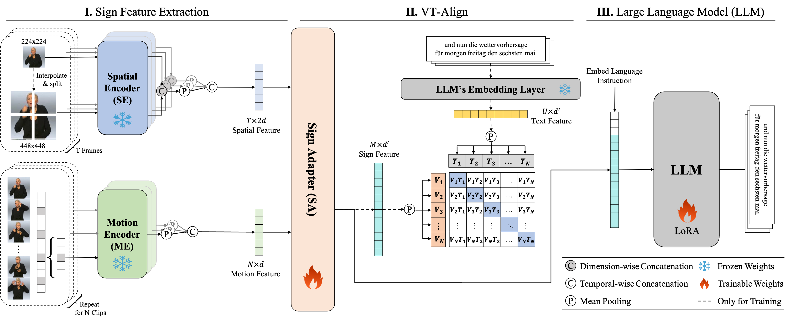

# An Efficient Gloss-Free Sign Language Translation Using Spatial Configurations and Motion Dynamics with LLMs

Official implementation for the NAACL 2025 [paper](https://aclanthology.org/2025.naacl-long.197.pdf): An Efficient Gloss-Free Sign Language Translation Using Spatial Configurations and Motion Dynamics with LLMs


## Introduction



We introduce a novel gloss-free framework, **Spa**tial and **Mo**tion-based Sign Language Translation (**SpaMo**). 
SpaMo is designed to fully exploit the spatial configurations and motion dynamics in sign videos using off-the-shelf visual encoders, without requiring domain-specific fine-tuning.
As shown in the figure above, the core idea is simple: We extract spatial features (representing spatial configurations) and motion features (capturing motion dynamics) using two different visual encoders, then feed these into an LLM with a language prompt.


## Environment

Install dependencies using:
```bash
pip install -r requirements.txt
```


## Data Preparation

We validate our method on three datasets:
- [Phoenix-2014T](https://www-i6.informatik.rwth-aachen.de/~koller/RWTH-PHOENIX-2014-T/)
- [CSL-Daily](http://home.ustc.edu.cn/~zhouh156/dataset/csl-daily/)
- [How2Sign](https://how2sign.github.io/)

### Spatial and Motion Features

SpaMo utilizes two complementary feature types:
1. **Spatial Features**: Extracted with ViT models to capture static visual information
2. **Motion Features**: Extracted with VideoMAE models to capture temporal dynamics

#### Extracting Spatial Features

To extract spatial features using the CLIP ViT model:

```bash
python scripts/vit_extract_feature.py \
    --anno_root ./preprocess/Phoenix14T \
    --model_name openai/clip-vit-large-patch14 \
    --video_root /PATH/TO/PHOENIX-2014-T-release-v3/PHOENIX-2014-T/ \
    --cache_dir /PATH/TO/CACHE_DIR \
    --save_dir /PATH/TO/SAVE_DIR \
    --s2_mode s2wrapping \
    --scales 1 2 \
    --batch_size 32 \
    --device cuda:0
```

Key parameters:
- `--model_name`: CLIP ViT model variant (default: openai/clip-vit-large-patch14)
- `--s2_mode`: Use "s2wrapping" for multi-scale feature extraction
- `--scales`: Scales for multi-scale feature extraction (default: 1 2)

#### Extracting Motion Features

To extract motion features using VideoMAE:

```bash
python scripts/mae_extract_feature.py \
    --anno_root ./preprocess/Phoenix14T \
    --model_name MCG-NJU/videomae-large \
    --video_root /PATH/TO/PHOENIX-2014-T-release-v3/PHOENIX-2014-T/ \
    --cache_dir /PATH/TO/CACHE_DIR \
    --save_dir /PATH/TO/SAVE_DIR \
    --overlap_size 8 \
    --batch_size 32 \
    --device cuda:0
```

For convenience, you can download our pre-extracted features from [here](https://www.dropbox.com/scl/fo/vgbws4cftewpoc6kudoap/AOtWs7adP4AvK0iT7KkWaJk?rlkey=nf3wp64zenqx3t2z695ndzcy7&st=9ydialet&dl=0).


## Model Training and Evaluation

### Training

Train the SpaMo model with:

```bash
python main.py -c configs/finetune.yaml -e bleu
```

### Evaluation

Evaluate a trained model using:

```bash
python main.py -c configs/finetune.yaml -e bleu --train False --test True --ckpt /PATH/TO/CHECKPOINT
```

Replace `/PATH/TO/CHECKPOINT` with your model checkpoint path.
Pre-trained checkpoints are available for download [here](https://www.dropbox.com/scl/fi/c9khflgxgl96lx919p6oq/spamo.ckpt?rlkey=gp3zmk6jwg9cnf3e2hpw268ih&st=u103orvs&dl=0).


## Citation

Please cite our works if you find this repo is helpful.

```bash
@inproceedings{hwang2025efficient,
  title={An Efficient Sign Language Translation Using Spatial Configuration and Motion Dynamics with LLMs},
  author={Hwang, Eui Jun and Cho, Sukmin and Lee, Junmyeong and Park, Jong C},
  booktitle={NAACL},
  year={2025}
}
```
